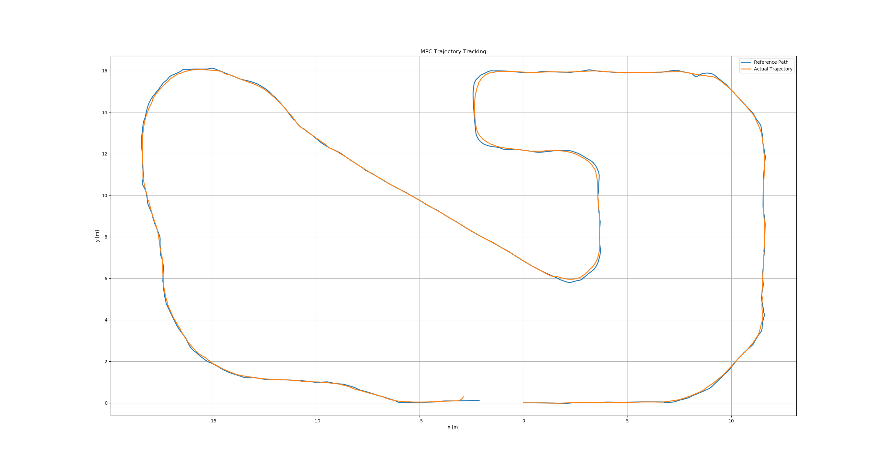

# TurtleBot Linear MPC Trajectory Tracking

## Project Overview
This project implements a Linear Model Predictive Control (MPC) algorithm for trajectory tracking of a TurtleBot in Gazebo simulation.

The controller predicts the future states of the robot and computes optimal control inputs by solving a quadratic programming (QP) problem.

## System Model
State variables:
- x position
- y position
- heading angle (θ)

Control inputs:
- linear velocity
- angular velocity

The kinematic model of the robot is linearized around the reference trajectory.

## MPC Formulation
The MPC controller minimizes a cost function consisting of

- state tracking error
- control input penalty

The optimization problem is formulated as a Quadratic Programming (QP) problem.

## Simulation Environment
- ROS
- Gazebo
- Python implementation

## Result

Reference trajectory vs actual trajectory

## Author
Junyoung Choi
